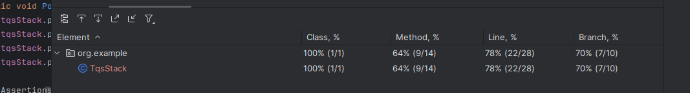
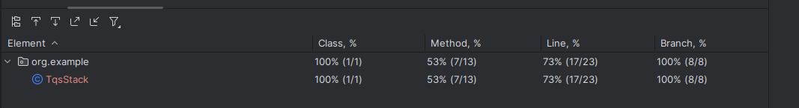
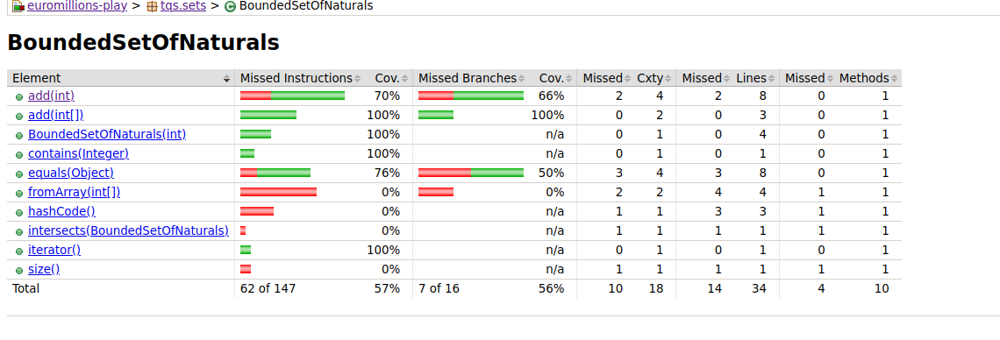
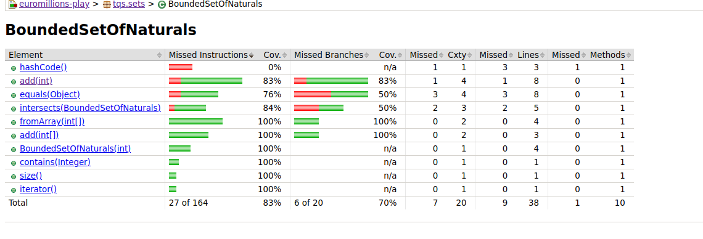

# Apontamentos das Aulas

## Testes em Java

### Ordem de Execução dos Testes
- **@Order(int)**: Utiliza-se a anotação `@Order(int)` para especificar a ordem pela qual os testes devem ser executados. Isto é útil quando a ordem de execução dos testes é relevante para o resultado.

### Nomes Descritivos para Testes
- **@DisplayName(String)**: A anotação `@DisplayName(String)` permite atribuir um nome descritivo ao teste, o que facilita a interpretação dos resultados. Este nome aparece nos relatórios de teste, tornando-os mais explicativos.

### Suprimir Testes Temporariamente
- **@Disabled**: Para suprimir um teste temporariamente, utiliza-se a anotação `@Disabled`. Esta abordagem é mais segura do que comentar o código do teste, pois mantém o código intacto e facilita a reactivação do teste no futuro.

### Cobertura de Testes (Coverage)
- **Cobertura de Testes**: A cobertura de testes deve tender para 100%, mas não é necessário (nem sempre prático) atingir 100%. Uma cobertura alta indica que a maior parte do código está a ser testada, mas a qualidade dos testes é mais importante do que a quantidade.

### Quantidade vs. Qualidade dos Testes
- **Quantidade de Testes**: A quantidade de testes não é um indicador directo da qualidade do código. É mais importante focar na qualidade dos testes, garantindo que eles cobrem cenários relevantes e edge cases.

## Boas Práticas
- **Foco na Qualidade**: Priorize a qualidade dos testes sobre a quantidade. Testes bem escritos e relevantes são mais valiosos do que uma grande quantidade de testes superficiais.
- **Manutenção**: Mantenha os testes actualizados e relevantes. Testes desactualizados podem levar a falsos positivos ou negativos, reduzindo a confiança na suite de testes.

## Exemplo de Código

```java
import org.junit.jupiter.api.*;

@DisplayName("Testes para a Classe X")
class ClasseXTest {

    @Test
    @Order(1)
    @DisplayName("Teste para o método Y")
    void testeMetodoY() {
        // Código do teste
    }

    @Test
    @Disabled("Este teste está temporariamente desactivado")
    @DisplayName("Teste para o método Z")
    void testeMetodoZ() {
        // Código do teste
    }
}

```

# Respostas ao guião 

## 1

### G)



- As percentagens de coverage não estão tão altas, pois alguns métodos irrelevantes como os getters e os setters não são testados

### H)



### J)

- **Casos de Erros não testados**: A cobertura de código garante que cada linha de código foi executada, mas não garante que todas as situações possíveis foram testadas. Por exemplo, o método popTopN(int n) pode falhar em casos como:

    n maior que o tamanho da pilha → Pode levar a uma exceção (ex: NoSuchElementException).
    
    n <= 0 → O comportamento pode ser inesperado ou não tratado corretamente.

Se não houver testes específicos para estes cenários, mesmo com 100% de cobertura, o código pode falhar.

## 2

### C)

- **Classe com Menos Coverage** : CuponEuromillions
- **Método com Menos Coverage** : generateRandomDraw(), generateDrawResults(), hashCode(), format(), countDips(), hashCode()

### D)

- **Coverage Antes** :



- **Coverage Depois** : 


