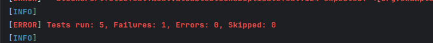

# Apontamentos sobre Mockito, Testes e Ferramentas Relacionadas

## Mockito

- **Mock faz implementações dummy**:
  - Usa-se `.thenReturn()` para especificar o retorno de um método mockado com base em um parâmetro de entrada específico.
  - Exemplo:
    ```java
    when(mockObject.method("input")).thenReturn("output");
    ```

- **UnnecessaryStubbingException**:
  - O Mockito é rigoroso por padrão e lança uma exceção (`UnnecessaryStubbingException`) se detectar stubs desnecessários (ou seja, stubs que nunca são usados durante a execução do teste).
  - Isso acontece porque o Mockito assume que stubs não utilizados podem indicar problemas na lógica do teste.
  - Para evitar isso, você pode configurar o Mockito para ser mais leniente:
    ```java
    @MockitoSettings(strictness = Strictness.LENIENT)
    ```

- **Comportamento padrão do Mock**:
  - Se um método mockado for chamado com um parâmetro que não foi especificado em nenhum `.thenReturn()`, o Mockito retorna um valor padrão do tipo correto (por exemplo, `0` para `int`, `false` para `boolean`, `null` para objetos).
  - Isso não causa problemas, mas pode ser útil para evitar exceções inesperadas.

---

## Hamcrest

- **Hamcrest**:
  - É uma biblioteca alternativa para asserções em testes.
  - Fornece uma sintaxe mais expressiva e legível para verificações.
  - Exemplo:
    ```java
    assertThat(actualValue, is(expectedValue));
    ```

---

## Injeção de Dependências com Mockito

- **@InjectMocks**:
  - A anotação `@InjectMocks` é usada para injetar mocks (anotados com `@Mock`) em uma classe sob teste.
  - Exemplo:
    ```java
    @Mock
    private Dependency dependency;

    @InjectMocks
    private ClassUnderTest classUnderTest;
    ```

---

## Testes no Maven

- **Testes Unitários vs. Testes de Integração**:
  - **Testes Unitários**:
    - São executados sempre no Maven, a menos que sejam explicitamente excluídos.
    - Por convenção, as classes de teste unitário devem terminar com `Test` (por exemplo, `MyClassTest.java`).
  - **Testes de Integração**:
    - São executados apenas durante a fase de `install` do Maven.
    - Por convenção, as classes de teste de integração devem terminar com `IT` (por exemplo, `MyClassIT.java`).

---

## Lombok

- **Lombok**:
  - É uma dependência que simplifica a escrita de código Java, especialmente para getters, setters, construtores e outros métodos boilerplate.
  - Exemplo:
    ```java
    @Getter @Setter
    private String name;
    ```

---

## Boas Práticas com Mockito

- **Mockito é rigoroso por padrão**:
  - O Mockito falha o teste se detectar stubs que não são usados durante a execução.
  - Isso garante que os testes sejam limpos e mantenham a lógica correta.
  - Para desativar esse comportamento, use:
    ```java
    @MockitoSettings(strictness = Strictness.LENIENT)
    ```

---

## Resumo de Anotações e Configurações

- **Anotações Comuns**:
  - `@Mock`: Cria um mock de uma classe ou interface.
  - `@InjectMocks`: Injeta mocks em uma classe sob teste.
  - `@MockitoSettings(strictness = Strictness.LENIENT)`: Configura o Mockito para ser leniente com stubs não utilizados.

- **Configurações de Strictness**:
  - `Strictness.STRICT`: Comportamento padrão do Mockito (falha em stubs não utilizados).
  - `Strictness.LENIENT`: Permite stubs não utilizados sem falhar o teste.
  - `Strictness.WARN`: Apenas emite um aviso para stubs não utilizados.

---

## Exemplo Completo de Teste com Mockito e Hamcrest

```java
import static org.mockito.Mockito.*;
import static org.hamcrest.MatcherAssert.assertThat;
import static org.hamcrest.Matchers.is;
import org.junit.jupiter.api.Test;
import org.mockito.InjectMocks;
import org.mockito.Mock;
import org.mockito.junit.jupiter.MockitoSettings;
import org.mockito.quality.Strictness;

@MockitoSettings(strictness = Strictness.LENIENT)
public class MyClassTest {

    @Mock
    private Dependency dependency;

    @InjectMocks
    private ClassUnderTest classUnderTest;

    @Test
    void testMethod() {
        // Configura o mock
        when(dependency.someMethod("input")).thenReturn("output");

        // Executa o método sob teste
        String result = classUnderTest.method("input");

        // Verifica o resultado
        assertThat(result, is("output"));
    }
}

```

# Respostas ao Guião

## Ex 1

### F)

- **A implementação por IA  não tem em conta o caso de haver duas stocks duplicadas**

```java
    @Test
    void mostValuableStocksDuplicateTest(){

        when(iStockMarketService.lookUpPrice("TSLA")).thenReturn(4.0);
        when(iStockMarketService.lookUpPrice("NVDA")).thenReturn(2.5);

        Stock tesla = new Stock("TSLA", 2);
        Stock tesla2 = new Stock("TSLA", 1);
        Stock nvidia = new Stock("NVDA", 4);

        stocksPortfolio.addStock(tesla);
        stocksPortfolio.addStock(nvidia);
        stocksPortfolio.addStock(tesla2);

        Stock testlaTotal = new Stock("TSLA", 3);

        List<Stock> stocks = stocksPortfolio.mostValuableStocks(1);

        assertEquals(List.of(testlaTotal), stocks);

    }
```

